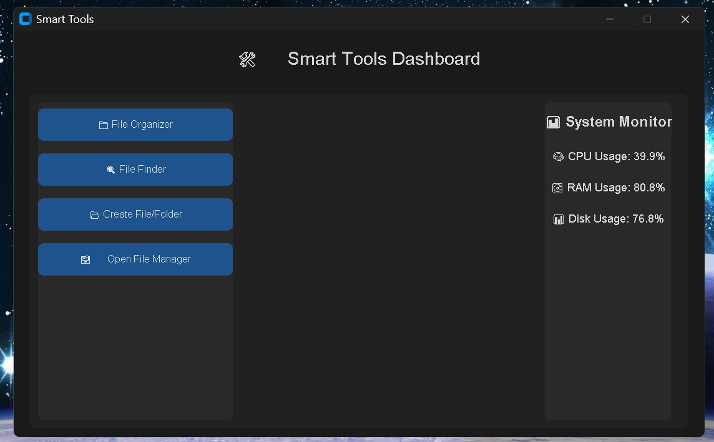
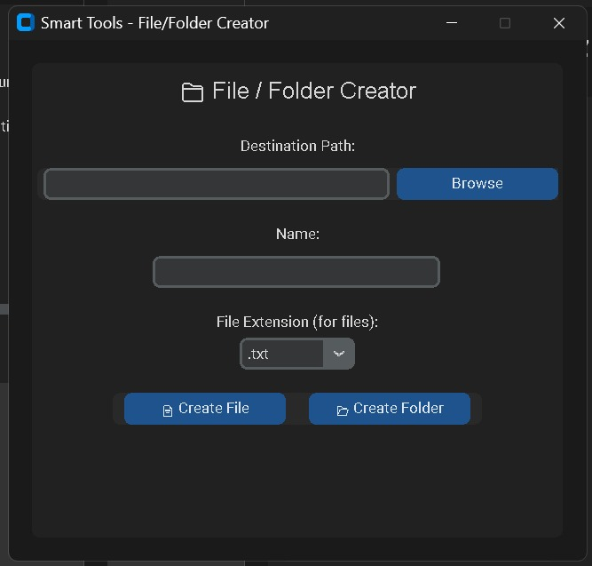
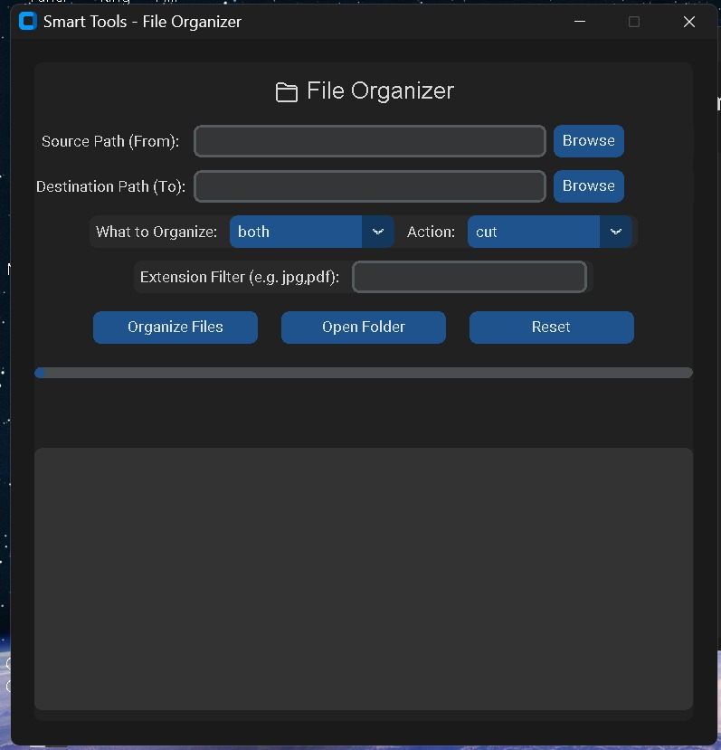
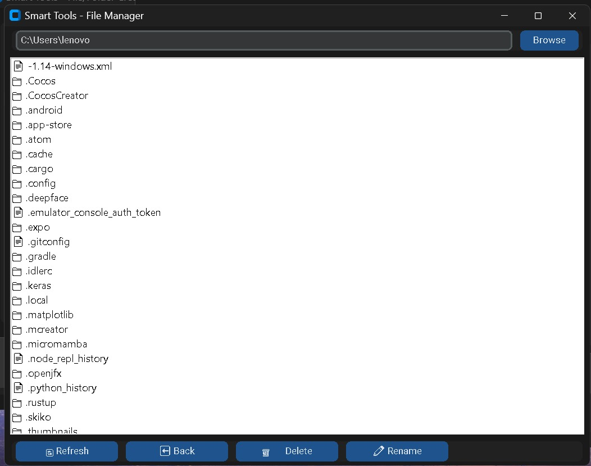
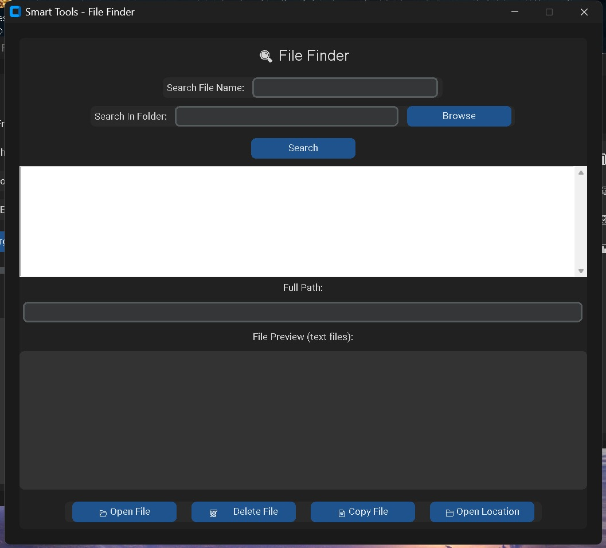

# 🛠️ Smart Tools – Python Utility Toolkit

**Smart Tools** is a multi-functional desktop utility app built with `customtkinter`. It helps users manage files and monitor system performance — all in a single, beautiful dark-themed GUI.

---

## 🚀 Features

| Tool              | Description                                                                 |
|-------------------|-----------------------------------------------------------------------------|
| 📁 File Organizer | Organize files into folders by extension (like Images, Docs, etc.)          |
| 🔍 File Finder    | Search files by name, preview text files, open, delete, or copy             |
| 📂 File/Folder Maker | Create new files or folders with one click                               |
| 🗃️ File Manager   | Browse, open, delete, or rename files/folders like a mini file explorer     |
| 📊 System Monitor | View live CPU, RAM, and Storage usage right on the home screen              |
| 🌙 Dark UI Theme  | Permanent dark theme with customtkinter’s modern look                       |

---

## 📸 Screenshots

### Home



### File Folder Creator



### File Organiser 



### File Manager



### File Finder



---

## 🧱 Tech Stack

- Python 3.10+
- [`customtkinter`](https://github.com/TomSchimansky/CustomTkinter)
- `psutil` (for system monitoring)
- `tkinter` (standard GUI library)

---

## 🖥️ How to Run

1. **Clone the repository**:
   ```bash
   git clone https://github.com/your-username/smart-tools.git
   cd smart-tools
   ```

2. **Install dependencies**:
   ```bash
   pip install customtkinter psutil
   ```

3. **Run the app**:
   ```bash
   python main.py
   ```

---

## 📁 Project Structure

```
Smart-Tools/
│
├── main.py                     # Main launcher with dashboard + system monitor
├── README.md                   # You're reading it!
├── modules/                    # All tool modules
│   ├── file_organizer.py
│   ├── file_finder.py
│   ├── file_manager.py
│   ├── file_maker.py
│   └── system_monitor.py       # (Optional if not separate anymore)
```

---

## 🙋 Author
Created with ❤️ by Maulik Singh Chauhan